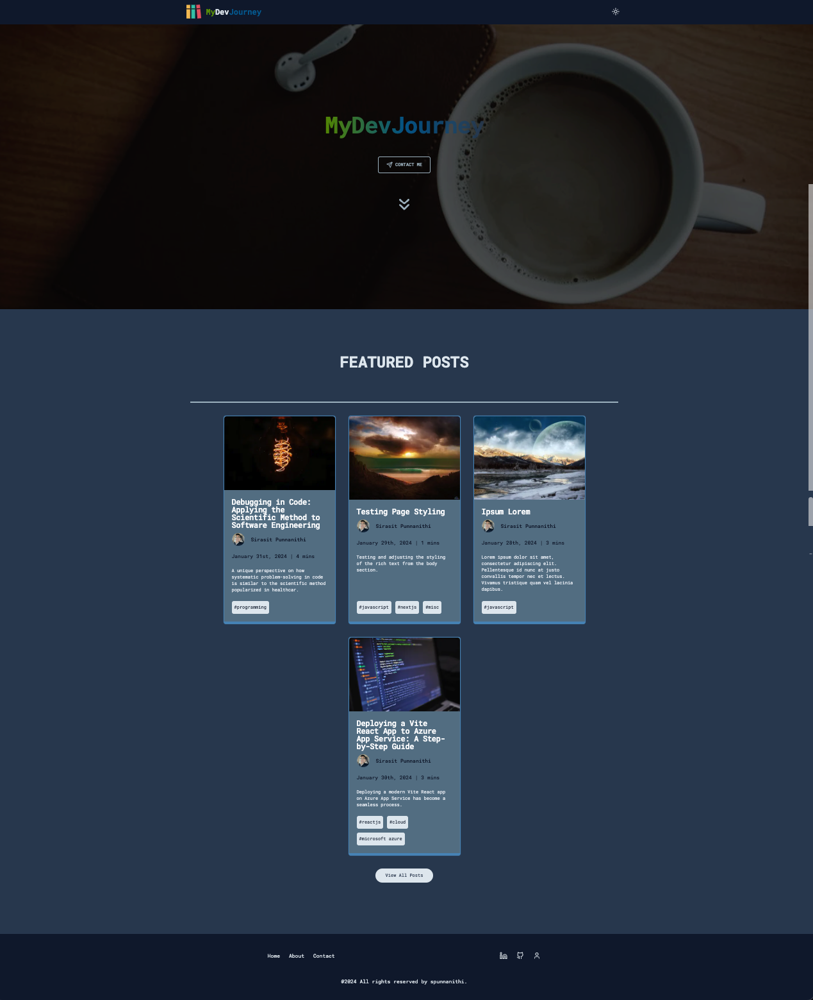
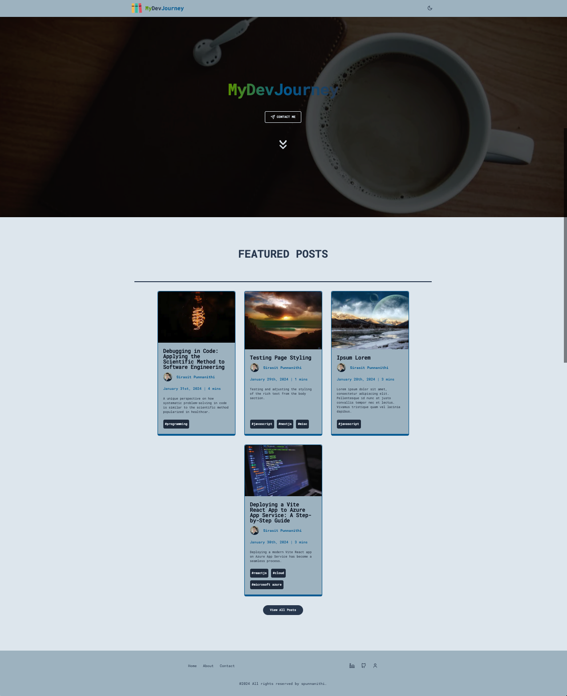
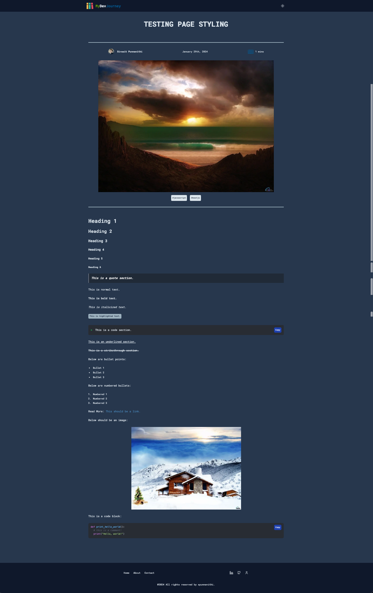
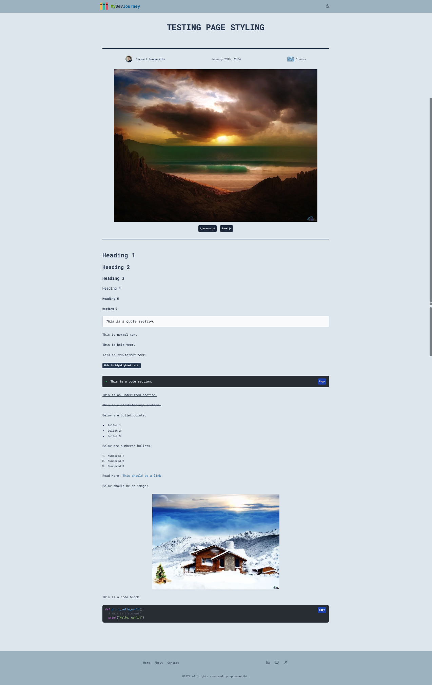

# MyDevJourney (NextJS/TailwindCSS/SanityCMS)

## Overview

Welcome to the MyDevJourney Blog project! This project aims to create an impressive and performant blog using Next.js for the frontend, Sanity CMS for content management system backend, and Tailwind CSS and shadcn/ui for styling.

Demo link: [MyDevJourney](https://mydevjourney.vercel.app/)

<table>
  <tr>
    <td>Landing Page (Dark Mode)</td>
    <td>Landing Page (Light Mode)</td>
  </tr>
  <tr>
    <td></td>
    <td></td>
  </tr>
 </table>

<table>
  <tr>
    <td>Post Page (Dark Mode)</td>
    <td>Post Page (Light Mode)</td>
  </tr>
  <tr>
    <td></td>
    <td></td>
  </tr>
 </table>

## Built with

- [NextJS](https://nextjs.org/) - Enables ability to create high-quality web applications with the power of React components and client/server side rendering.
- [SanityCMS](https://www.sanity.io/) - Flexible and developer-friendly headless content management system that empowers teams to create and manage digital content seamlessly across various platforms.
- [TailwindCSS](https://tailwindcss.com/) - Utility-first CSS framework that streamlines web development by providing a set of pre-designed, low-level utility classes for building modern and responsive user interfaces.
- [shadcn/ui](https://ui.shadcn.com/) - Highly customizable, re-useable component library that is easy to copy and paste into code base.
- [Vercel](https://vercel.com/) - Fast, easy cloud deployment of frontend applications.

## Features

- Dark/light mode
- Sanity Studio integration - Fast and easy content management
- Scroll to Top button - Seamless navigation
- Table of Contents - Explore and navigate to each heading for blog post

## Project Structure

Here is an overview of the project structure:

```bash
blog-nextjs-cms/
|-- __test__/
|-- app/
|   |-- (admin)/
|   |-- (client)/
|   |-- icon.svg (or favicon.ico)
|-- components/
|-- constants/
|-- data/
|-- lib/
|-- public/
|-- sanity/
|-- styles/
|-- .env.local
|-- .gitignore
|-- jsconfig.json
|-- next.config.mjs
|-- sanity.cli.js
|-- sanity.config.js
|-- package.json
|-- tailwind.config.js
```

- **app/**: NextJS app router.
  - **(admin)/**: Sanity Studio app pages.
  - **(client)/**: Blog client app pages.
  - **icon.svg or favicon.ico**: Image used for web browser tabs, phone home screens, and search engine results.
- **components/**: React components used in the application.
- **constants/**: Contains information that will be used throughout the app and not changed often.
- **data/**: Contains data points that can be easily changed and affected on certain app components.
- **lib/**: Contains app-specific ultility functions.
- **public/**: Static assets like images, fonts, etc.
- **sanity/**: Contains sanity related helper functions, utilities, environment configuration and schemas.
- **styles/**: Global and component-specific styles.
- **.env.local**: Contains all environment variables
- **.gitignore**: Git ignore file to exclude unnecessary files and directories.
- **jsconfig.json**: Next.js JSON configuration file.
- **next.config.mjs**: Next.js configuration file.
- **sanity.config.js**: Sanity CMS configuration file.
- **sanity.cli.js**: Sanity CMS CLI command file.
- **package.json**: Node.js project configuration.
- **tailwind.config.js**: Tailwind CSS configuration file.

## Requirements

Before starting, make sure you have the following installed:

- Node.js: [Download and install Node.js](https://nodejs.org/en)
- Node package manager (should have at least one):
  - [npm](https://www.npmjs.com/)
  - [yarn](https://yarnpkg.com/)
  - [pnpm](https://pnpm.io/)
  - [bun](https://bun.sh/)
- Sanity CMS account: [Sign up here](https://www.sanity.io/)

## Getting Started

### Installation

1. Clone the repository:

```bash
git clone https://github.com/your-username-here/blog-nextjs-cms.git
```

2. Navigate to the project folder:

```bash
cd blog-nextjs-cms
```

3. Install dependencies:

```bash
npm install
# or
yarn add
# or
pnpm install
# or
bun add
```

### Configuration

1. Sanity CMS

2. TailwindCSS

3. Next.js

### Running the Project

1. Run the development server:

```bash
npm run dev
# or
yarn dev
# or
pnpm dev
# or
bun dev
```

2. Once ready for production, build Next.js project:

```bash
npm run build
```

3. Start Next.js production server:

```bash
npm run start
```

Open [http://localhost:3000](http://localhost:3000) with your browser to see the result.

You can start editing the page by modifying `app/(client)/page.jsx`. The page auto-updates as you edit the file.

This project uses [`next/font`](https://nextjs.org/docs/basic-features/font-optimization) to automatically optimize and load Inter, a custom Google Font.

## Deploy on Vercel

The easiest way to deploy your Next.js app is to use the [Vercel Platform](https://vercel.com/new?utm_medium=default-template&filter=next.js&utm_source=create-next-app&utm_campaign=create-next-app-readme) from the creators of Next.js.

Check out our [Next.js deployment documentation](https://nextjs.org/docs/deployment) for more details.
